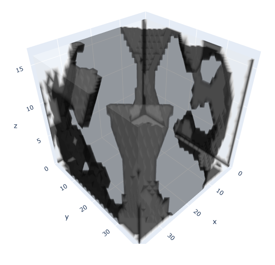
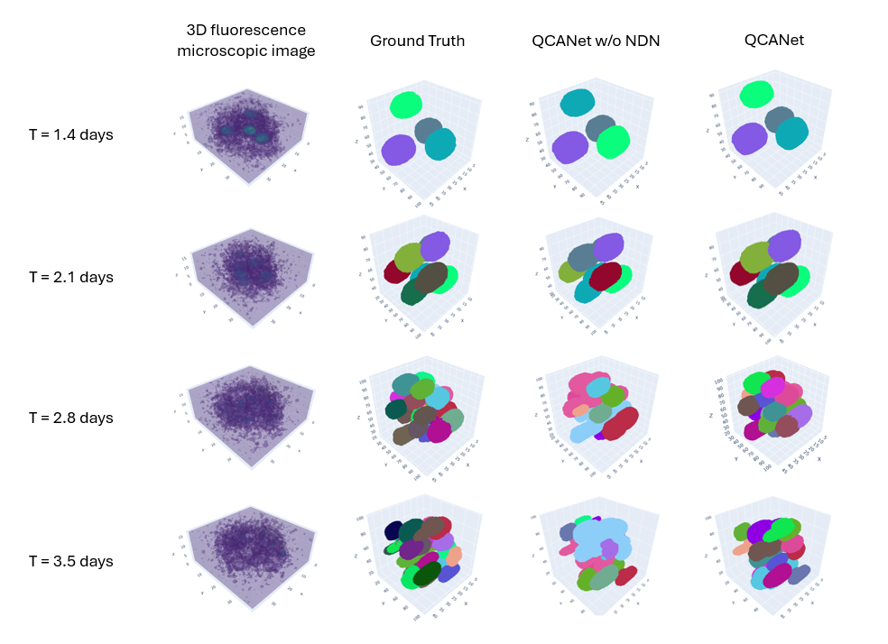

# Introduction
We present our efforts to reproduce [Tokuoka et al.](https://www.nature.com/articles/s41540-020-00152-8) 's research, aimed to segment individual nuclei during embryogenesis through the use of a Quantitative Criteria Acquisition Network (QCANet). QCANet is a convolutional neural network aimed at segmenting individual nuclei during embryogenesis with the purpose of aiding research in revealing the mechanisms behind embryogenesis. During the development of an embryo, cells divide, start to cluster and eventually organize themselves in distinct structures. At the time of publishing, most segmentation algorithms used for the purpose of segmenting these structures, required preset parameter values and were heuristically based. Therefore, there was a need for an improved way of automated segmenting. The authors did this by developing QCANet: a 3D CNN with two separate subnetworks which are combined in a post processing step to create a final segmented image.  
### Goal
The purpose of our research was to reproduce Figure 3 from the paper where the authors show direct results of the QCANet and compare it to the ground truth, 3D U-Net, and QCANet w/o NDN, aiming for the completion of our objective. To prioritize focus areas, we decided to leave out the 3D Mask R-CNN comparison.

  

  

*Figure 1: The goal of our reproducibility project. Figure 3 from the paper by Tokuoka et al..*
### QCANet Overview
Before we explore our reproducibility efforts, let us first explain the concept behind QCANet. This system employs two interconnected subnetworks: the Nuclear Segmentation Network (NSN) and the Nuclear Detection Network (NDN). The NSN is designed to distinguish cells from the background, whereas the NDN identifies individual cells within clusters. This dual approach enables instance segmentation, where each cell is individually labeled rather than being simply classified as "cell" (see diagram below). The addition of the NDN significantly enhances the traditional 3D U-Net architecture predominantly utilized by the NSN. The NSN uses stochastic gradient descent for optimization, and the NDN utilizes the Adam algorithm. Both networks process 3D microscopic data and are combined in a post-processing step, where the NSN serves as a mask to apply watershed techniques to the NDN outputs, as illustrated in the last column of Figure 3. 

  

  

*Figure 2: Diagram taken from [Tokuoka et al.](https://www.nature.com/articles/s41540-020-00152-8) explaining the difference between semantic and instance segmentation.*

---
# Approach
For our reproduction we took a parallel approach. We had 4 different objectives. 1) Reproducing QCANet results with code and learned models provided by the authors. 2) Reproducing QCANet results with models that we trained ourselves. 3) Evaluating hyperparameter sensitivity of the QCANet models. 4) Reproducing 3D U-Net results. All these objectives were worked on in parallel and will be discussed in more detail below. All our code can be found [here](https://github.com/filipxg/DL-Reproducibility).

### 1.	Reproduction of QCANet with published code and models  
We utilized the original code and pre-trained models from the authors to replicate the results. Due to computational limitations, we migrated the execution to Kaggle to leverage GPU support, requiring significant adaptations to convert command-line operations into a notebook-friendly format. The limited documentation presented challenges, but we successfully reproduced parts of the results shown in Figure 3 of the paper. Our adapted code is available in `qcanet-inference.ipynb` on our [GitHub repository](https://github.com/filipxg/DL-Reproducibility).
### 2.	Reproducing the learned QCANet models 
We encountered substantial obstacles in training new QCANet models, including outdated dependencies and undocumented code. Although initial attempts (found in `qcanet-training.ipynb`) to train using the old codebase failed, we later identified a [PyTorch](https://github.com/funalab/QCANet/tree/pytorch) implementation that simplified the process. Time constraints, however, limited us to conducting only a preliminary ablation study using this newer setup, detailed in `qcanet-ablation.ipynb`.
### 3.	Evaluating hyperparameter sensitivity
We shifted our investigation of hyperparameter sensitivity in QCANet models to a PyTorch-based framework, leveraging [Optuna](https://optuna.org/) for systematic optimization, with a primary focus on exploring variations in learning rate. The outcomes of these evaluations are documented in our [GitHub repository](https://github.com/filipxg/DL-Reproducibility). We discovered that a very low learning rate was most effective across the models tested. Initially, we chose to adjust only the learning rate for simplicity, allowing easy modification of other parameters like batch size or epochs later on. Our use of Optuna required extensive Kaggle resources and time. However, following the methodology of [Tokuoka et al.](https://www.nature.com/articles/s41540-020-00152-8), who utilized 150 epochs per model, we adopted the same approach rather than optimizing for an ideal number of epochs. Constraints on memory limited us to a batch size of 1, as using larger batches would exceed the available memory on Kaggle's GPUs.
### 4.	Reproduction of the 3D U-Net results
As our initial goal was to reproduce Figure 3 from their paper, we lastly also took a look at the 3D U-Net implementation. By implementing this network as well, we could compare the results and see if QCANet indeed outperformed 3D U-Net. The authors themselves did not provide any code for 3D-UNet, but we took [3D-Unet](https://github.com/wolny/pytorch-3dunet) as a baseline to implement this network. We set up this model in Kaggle. Our DiceLoss was used as loss function and IoU as an accuracy metric. For the hyperparameters, everything that was stated in the paper and references was used and missing parameters were estimated using Bayesian estimation with Optuna. The model successfully converged and achieved good IoU’s. However, the results looked nothing like we would expect. We were not able to deduct what went wrong, and therefore excluded these results from our final results. Our efforts can be found in `3dunet.ipynb` on our [Github](https://github.com/filipxg/DL-Reproducibility).  

  

  

*Figure 3: Visualization of the results from our trained 3D-UNet. No cells could be detected.*   

## Loss Function
We encountered issues with the dice loss function provided by the utilized library, which returned negative values. To resolve this, we derived the dice coefficient loss directly from the formulation provided in the referenced [paper](https://arxiv.org/pdf/1606.04797.pdf):

$$D = \frac{2 \times \sum_{i}^{N} p_{i} g_{i}}{\sum_{i}^{N} p_{i}^{2} + \sum_{i}^{N} g_{i}^{2}}$$

This equation calculates the dice coefficient, \(D\), where \(N\) is the total number of voxels, \(p_i\) represents the predicted binary segmentation values, and \(g_i\) denotes the ground truth values. This loss function was implemented and applied across all our models to ensure consistency in performance assessment.

---
# Results
  

*Figure 4: The results from reproducing QCANet using the published code and models found on [Github](https://github.com/funalab/QCANet).*  

We managed to partially replicate Figure 3, which showcased 3D fluorescence microscopic images, the ground truth, QCANet without NDN, and the full QCANet implementation, as depicted in the figure above. Notably, the addition of NDN significantly enhanced the network's performance; the NSN alone tended to assign a single label to touching nuclei. The NDN facilitated the separation of these nuclei, a benefit that became increasingly evident in samples with higher nuclei counts, where the likelihood of overlap escalates.

Furthermore, we conducted an ablation study on the NSN model. Our modifications included replacing the ReLU activation function with a Sigmoid and disconnecting the pathways between the convolutional and deconvolutional layers. The results, illustrated in the graphs below, indicate that the Sigmoid activation markedly underperformed relative to the ReLU. Conversely, removing the inter-layer connections did not severely impact the network's initial training phase over 10 epochs, though further analysis is required to fully assess the significance of these connections.

  
*Figure 5: Results of our ablation study, showing the influence of changing the ReLU to a Sigmoid and removing the connections between the convolutional and deconvolutional layers*

# Discussion
While the authors clearly put effort into making their results reproducible by publishing their code, their learned models, some of their hyperparameters and part of the data they used, there were also quite some things that made reproducibility difficult. The primary issue was the lack of documentation of the code, this complicated understanding the code's functionality and troubleshooting errors. Moreover, training the NDN model proved to be difficult due to the goal of the algorithm: it has to detect a few pixels within the full image. Even minor mislabeling by the model could still result in high accuracy since most of the image is background, complicating the training process. Lastly, our ablation study suggests that the connection between the convolutional and deconvolutional layers in the QCANet's NSN might not be crucial. Further research is needed to determine this. 
