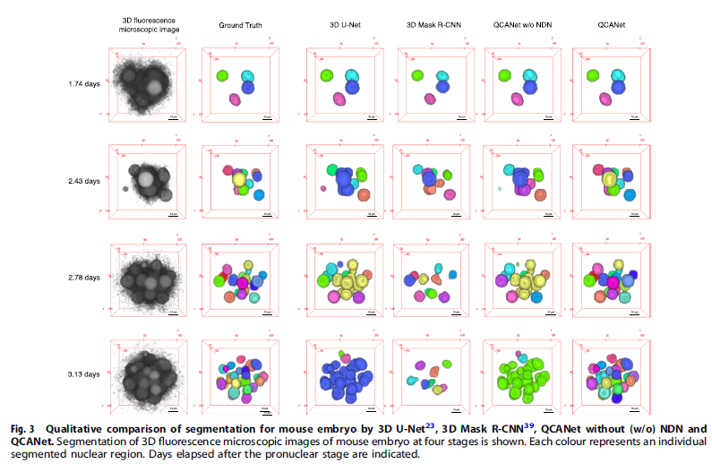
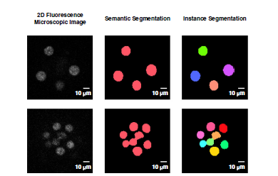
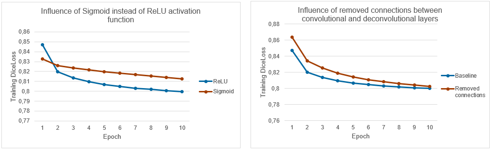

# Introduction
In this blog post, our efforts to reproduce the results published in the paper “3D convolutional neural networks-based segmentation to acquire quantitative criteria of the nucleus during mouse embryogenesis” from Tokuoka et al. will be discussed. In the paper, the Quantitative Criteria Acquisition Network (QCANet) is presented. It is a convolutional neural network aimed at segmenting individual nuclei during embryogenesis with the purpose of aiding research in revealing the mechanisms behind embryogenesis. During the development of an embryo, cells divide, start to cluster and eventually organize themselves in distinct structures. At the time of publishing, most segmentation algorithms used for the purpose of segmenting these structures, required preset parameter values and were heuristically based. Therefore, there was a need for an improved way of automated segmenting. The authors did this by developing QCANet: a 3D CNN with two separate subnetworks which are combined in a post processing step to create a final segmented image.  
### Goal
Our main goal was to reproduce Figure 3 (see below) from the paper where the authors show direct results of the QCANet and compare it to the ground truth, 3D U-Net, 3D Mask R-CNN and QCANet w/o NDN respectively. Due to time constraints on this reproducibility project we decided to leave out the 3D Mask R-CNN comparison.  
  
  

### QCANet basics
Before we go into our reproducibility efforts, we will first explain the idea behind QCANet. QCANet is based on two subnetworks: one for the segmentation of the cells from the background and one for detecting individual cells from one another. This first network is called the Nuclear Segmentation Network (NSN) and the second the Nuclear Detection Network (NDN). These two networks allow for instance segmentation, where each cell is labelled individually instead of only labelled as “cell” (see Figure 2).  The improvement of QCANet is based on the addition of the NDN as the NSN is mainly based on the architecture of 3D U-Net. NSN uses stochastic gradient descent for optimization, whereas NDN uses Adam. Both networks use 3D microscopic data as input. The two networks are combined in a post-processing step where the NSN is used as a mask for using watershed on the NDN results. This results in figures such as the last column of Figure 3.  

  
_Diagram taken from the QCANet paper explaining the difference between semantic and instance segmentation._

# Approach
For our reproduction we took a parallel approach. We had 4 different objectives. 1) Reproducing QCANet results with code and learned models provided by the authors. 2) Reproducing QCANet results with models that we trained ourselves. 3) Evaluating hyperparameter sensitivity of the QCANet models. 4) Reproducing 3D U-Net results. All these objectives were worked on in parallel and will be discussed in more detail below. All our code can be found on: https://github.com/filipxg/DL-Reproducibility.
### 1.	Reproduction of QCANet with published code and models  
For the reproduction of their results, we started by looking at the publicly available code on Github : https://github.com/funalab/QCANet. Trying to run it locally proved challenging due to our limited CPU power. To overcome this, we ported the code to Kaggle to be able to use a GPU. However, the code written by the authors is written as a command line tool which is not possible in Kaggle. Therefore, we had to rewrite the code such that it was runnable in a notebook. The absence of documentation for the code made this porting process tedious. Next to their code, the authors also provided two learned models, one for the NSN and one for the NDN. With the stripped version of their code and these two learned models we were able to reproduce parts of the results in Figure 3 of the paper. The code for this can be found in qcanet-inference.ipynb on our Github. The results will be discussed in the “Results” part of the blog.
### 2.	Reproducing the learned QCANet models 
Next, we tried to train our own QCANet models to see how well we would be able to reproduce their learned models. This proved to be quite a challenge. As mentioned before, the lack of documentation made debugging difficult. Next tot that, the code we tried to use was 5-6 years old and therefore quite some pip package versions errors could not be resolved. Our attempts to get this to work can be found in qcanet-training.ipynb. However, after we gave up on this version of QCANet, we discovered a PyTorch version of the code on Github (https://github.com/funalab/QCANet/tree/pytorch). We realized this would make training easier, but due to the lack of time left we decided to only do an ablation study on the NSN using this version. The code for this can be found in qcanet-ablation.ipynb. The results of this ablation study can be found in the “Result” paragraph of this blog.
### 3.	Evaluating hyperparameter sensitivity
For the hyperparameter sensitivity evaluation, we ran into the same issues as when trying to train our own models. Luckily, PyTorch proved to be a solution to this as well. Using optuna, we were able to set up a study to evaluate the influence of the learning rate. ##Results?? Our efforts can be found in ## on our github.
### 4.	Reproduction of the 3D U-Net results
As our initial goal was to reproduce Figure 3 from their paper, we lastly also took a look at the 3D U-Net implementation. By implementing this network as well, we could compare the results and see if QCANet indeed outperformed 3D U-Net. The authors themselves did not provide any code for 3D-UNet, but we took https://github.com/wolny/pytorch-3dunet as a baseline to implement this network. We set up this model in Kaggle. DiceLoss was used as loss function and IoU as an accuracy metric. For the hyperparameters, everything that was stated in the paper and references was used and missing parameters were estimated using Bayesian estimation with optuna. The model successfully converged and achieved good IoU’s. However, the results looked nothing like we would expect (see figure ##). We were not able to deduct what went wrong, and therefore excluded these results from our final results. Our efforts can be found in 3dunet.ipynb on our Github.  
  
\~Figure with 3D U-Net results?~

# Results
\~FINAL FIGURE~  
In the end we were able to reproduce Figure 3 partly, containing the 3D fluorescence microscopic images, the ground truth, the QCANet without NDN and the full QCANet as visible in the figure above. It is clearly visible that adding the NDN drastically improves performance of the network, as NSN on its own give nuclei that touch, only one label. NDN allows for the separation of these nuclei as well. This becomes especially visible in samples with more nuclei as the chances of them overlapping increases as the number of nuclei increase.   
  
Next, we also did an ablation study on the NSN model where we first tried to use a Sigmoid activation function instead of a ReLU activation study and secondly removed the connections between the convolutional and deconvolutional layers. In the graphs below the results for this can be found. We ran both ablation studies for 10 epochs and noticed that the Sigmoid clearly underperforms compared to the ReLU. On the other hand, when the connection between the convolutional and deconvolutional layers is removed, the network still seems to be able to train well, at least for the first 10 epochs. Further investigation is needed to determine the full importance of this connection. 

  
_Results of our ablation study, showing the influence of changing the ReLU to a Sigmoid and removing the connections between the convolutional and deconvolutional layers_

# Discussion
Even though the authors clearly put effort into making their results reproducible by publishing their code, their learned models, most of their hyperparameters and part of the data they used, there were also quite some things that made reproducibility difficult. The main issue was the lack of documentation of the code, this made understanding what happened where and how to fix certain errors difficult. Next to that, training the NDN model proved to be difficult due to the goal of the algorithm: it has to detect a few pixels within the full image. This means that if it labels the full image as background it still achieves really high accuracies. This makes training the model very difficult. Lastly, our ablation study shows signs that the connection between the convolutional and deconvolutional layers in the NSN of QCANet might not be of great addition to the network. Further research is needed to determine this. 
